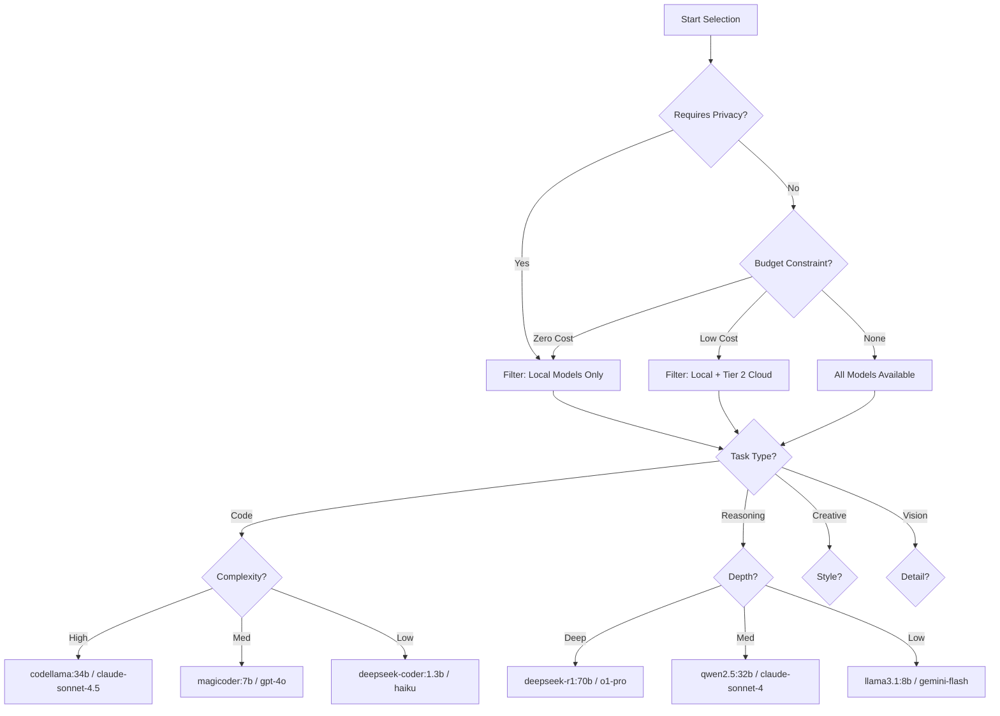

# Agent Instructions File Format v2.1
## LLM-Optimized Agent Definition Specification with Orchestration Protocol

---

# SECTION 0: INSTRUCTIONS FOR LLM USING THIS SPECIFICATION

## 0.1 Purpose of This Document
You are an LLM tasked with creating or transforming agent definition files. This specification defines the standard format for autonomous agent configuration. Follow these instructions to produce compliant agent files.

## 0.2 When to Use This Specification

### Creating a NEW Agent File:
```
IF user provides: requirements, role description, or task definition
THEN:
  1. Read entire specification (Sections 1-18)
  2. Follow "Agent Creation Workflow" (Section 0.3)
  3. Populate all required sections
  4. Generate examples and test cases
  5. Validate against specification schema
  6. Output complete agent file
```

### Transforming an EXISTING Agent File:
```
IF user provides: existing agent file in any format
THEN:
  1. Parse existing file and extract components
  2. Map components to this specification structure
  3. Fill gaps with reasonable defaults
  4. Preserve original intent and constraints
  5. Add missing required sections
  6. Enhance with planning/estimation/delegation protocols
  7. Validate against specification schema
  8. Output transformed agent file with changelog
```

## 0.3 Agent Creation Workflow

```yaml
workflow:
  step_1_requirements_analysis:
    task: "Extract and structure requirements"
    questions_to_answer:
      - "What is the agent's primary objective?"
      - "What resources does it need access to?"
      - "What are the success criteria?"
      - "What are the failure modes?"
      - "Who/what does it interact with?"
    output: "requirements_summary.yaml"
    
  step_2_scope_definition:
    task: "Define boundaries and constraints"
    questions_to_answer:
      - "What can this agent modify/access?"
      - "What must it never touch?"
      - "When should it ask for help?"
      - "What are the resource limits?"
    output: "scope_contract.yaml"
    
  step_3_decomposition_analysis:
    task: "Identify if sub-agents are needed"
    decision_criteria:
      requires_subagents_if:
        - "Task has >3 distinct phases requiring different expertise"
        - "Subtasks can run in parallel"
        - "Different subtasks need different model capabilities"
        - "Task complexity exceeds single agent context window"
        - "Specialized domain knowledge needed for subtasks"
      remains_single_agent_if:
        - "Task is linear and simple"
        - "All operations require same context"
        - "Total complexity < 5 steps"
        - "No parallel processing opportunities"
    output: "agent_architecture.yaml"
    
  step_4_model_selection_strategy:
    task: "Define model selection criteria"
    use_framework: "See Section 0.5 - Model Selection Framework"
    consider:
      - "Task complexity and reasoning requirements"
      - "Context window needs"
      - "Cost constraints and optimization strategy"
      - "Speed vs quality tradeoffs"
      - "Special capabilities (vision, code, reasoning)"
    output: "model_strategy.yaml"
    
  step_5_planning_framework:
    task: "Define how agent creates execution plans"
    use_framework: "See Section 0.6 - Planning Protocol"
    output: "planning_protocol.yaml"
    
  step_6_estimation_framework:
    task: "Define cost and complexity estimation"
    use_framework: "See Section 0.7 - Estimation Protocol"
    output: "estimation_protocol.yaml"
    
  step_7_delegation_protocol:
    task: "Define subagent delegation rules"
    use_framework: "See Section 0.8 - Delegation Protocol"
    output: "delegation_protocol.yaml"
    
  step_8_complete_specification:
    task: "Generate complete agent file"
    actions:
      - "Populate all sections 1-18"
      - "Include concrete examples"
      - "Add validation criteria"
      - "Generate test cases"
    output: "agent_specification_v2.1.yaml"
```

## 0.4 Agent vs Sub-Agent Relationship Model

```yaml
relationship_model:
  
  parent_agent:
    role: "Coordinator and decision maker"
    responsibilities:
      - "Receive top-level task from user"
      - "Create execution plan (see Section 0.6)"
      - "Estimate complexity and costs (see Section 0.7)"
      - "Decide when to delegate (see Section 0.8)"
      - "Select appropriate sub-agents"
      - "Aggregate sub-agent outputs"
      - "Validate final results"
      - "Report to user"
    
    file_location: "/agents/[agent-name].agent.yaml"
    naming_convention: "[domain]-[role]-agent.yaml"
    example: "model-orchestrator-agent.yaml"
    
  sub_agent:
    role: "Specialist executor"
    responsibilities:
      - "Receive scoped task from parent agent"
      - "Create sub-plan if needed"
      - "Estimate own costs and complexity"
      - "Execute specialized task"
      - "Return structured results to parent"
      - "Report errors with recovery suggestions"
    
    file_location: "/agents/subagents/[parent-agent]/[subagent-name].subagent.yaml"
    naming_convention: "[parent-name]-[specialty]-subagent.yaml"
    example: "model-orchestrator-task-analysis-subagent.yaml"
    
  key_differences:
    scope:
      parent: "Broad, multi-phase tasks"
      sub: "Narrow, specialized tasks"
    
    delegation_authority:
      parent: "Can delegate to multiple sub-agents"
      sub: "Can only escalate back to parent or delegate to sibling if authorized"
    
    model_selection:
      parent: "Selects model for coordination and aggregation"
      sub: "Selects model optimized for specialized task"
    
    planning_depth:
      parent: "High-level multi-phase planning"
      sub: "Detailed single-phase execution planning"
    
    estimation_scope:
      parent: "Estimates total cost including all sub-agents"
      sub: "Estimates only own execution cost"
```

## 0.5 Model Selection Framework

This framework defines how agents select the appropriate model for a given task. It covers 63 models across 8 providers.

### 0.5.1 Provider Tiers & Models

#### Tier 1: Local / Free (Privacy & Cost Optimized)
*Always prefer these models first unless specific capabilities are missing.*
- **Reasoning**: `deepseek-r1:70b`, `qwen2.5:32b`, `qwen3:8b`
- **Code**: `codellama:34b`, `magicoder:7b`, `deepseek-coder:1.3b`, `codellama:13b`
- **General**: `llama3.1:70b`, `llama3.1:8b`, `llama3.2:3b`, `gemma:7b`, `qwen2.5:7b-instruct`
- **Vision**: `llama-3.2-90b`, `llama-3.2-11b`

#### Tier 2: Fast Cloud (Speed & Low Cost)
- **Google**: `gemini-2.0-flash`, `gemini-1.5-flash`
- **Anthropic**: `claude-3-haiku`
- **OpenAI**: `gpt-4o-mini`
- **xAI**: `grok-4-fast-non-reasoning`

#### Tier 3: Balanced Cloud (Quality & Reliability)
- **Anthropic**: `claude-3.5-sonnet`, `claude-sonnet-4`, `claude-sonnet-4.5`
- **OpenAI**: `gpt-4o`, `gpt-4-turbo`
- **Google**: `gemini-2.0-pro`
- **xAI**: `grok-3`, `grok-4-fast-reasoning`

#### Tier 4: Premium / Specialized (Maximum Capability)
- **Reasoning**: `o1-pro`, `o1`, `o3`, `claude-opus-4.1`, `claude-opus-4`
- **Context**: `grok-4-fast-reasoning` (2M), `gemini-2.0-pro` (2M)
- **Vision**: `gpt-4o`, `grok-2-vision-1212`

### 0.5.2 Selection Decision Tree



### 0.5.3 Task Classification & Recommended Models

| Task Category | Primary Recommendation (Local) | Secondary Recommendation (Cloud) |
|---------------|--------------------------------|----------------------------------|
| **Code Generation** | `codellama:34b` | `claude-sonnet-4.5` |
| **Code Review** | `deepseek-r1:70b` | `claude-opus-4.1` |
| **Debugging** | `deepseek-r1:70b` | `o1-pro` |
| **System Design** | `deepseek-r1:70b` | `claude-opus-4.1` |
| **Complex Reasoning** | `deepseek-r1:70b` | `o1-pro` |
| **Data Analysis** | `qwen2.5:32b` | `gemini-2.0-pro` |
| **Creative Writing** | `qwen2.5:32b` | `claude-opus-4.1` |
| **Storytelling** | `qwen2.5:32b` | `gpt-4.1-2025` |
| **Translation** | `qwen2.5:32b` | `gemini-2.0-flash` |
| **Summarization** | `llama3.1:8b` | `claude-3-haiku` |
| **Quick QA** | `llama3.2:3b` | `gpt-4o-mini` |
| **Vision Analysis** | `llama-3.2-90b` | `gpt-4o` |
| **Research** | `deepseek-r1:70b` | `grok-4-fast-reasoning` |

### 0.5.4 Selection Patterns

#### 1. Single Model (Default)
Select the single best model based on task type, cost, and performance requirements.
*Example: Use `magicoder:7b` for generating a Python function.*

#### 2. Chain of Thought (Sequential)
Use a fast model for drafting and a powerful model for refinement.
*Example: `deepseek-coder:1.3b` (Draft) -> `codellama:34b` (Refine)*

#### 3. Consensus (Parallel)
Use multiple diverse models to vote on a critical decision.
*Example: `deepseek-r1:70b` + `claude-opus-4.1` + `o1-pro` for architectural decision.*

#### 4. Hierarchical (Delegation)
Parent agent uses a coordinator model, sub-agents use specialist models.
*Example: Parent (`claude-sonnet-4.5`) delegates to Sub-agent (`codellama:34b`).*

## 0.6 Planning Protocol

Agents must follow this 6-phase planning process for complex tasks.

### Phase 1: Intent Analysis
- **Input**: User request
- **Action**: Analyze intent, identify constraints, determine success criteria.
- **Output**: Structured Goal Statement

### Phase 2: Information Gathering
- **Input**: Goal Statement
- **Action**: Identify missing information, query knowledge base, ask clarifying questions.
- **Output**: Context Object

### Phase 3: Strategy Formulation
- **Input**: Goal + Context
- **Action**: Select approach (e.g., "Divide and Conquer", "Linear Execution").
- **Output**: Strategy Document

### Phase 4: Plan Generation
- **Input**: Strategy
- **Action**: Break down into steps. Each step must have:
  - Description
  - Expected Output
  - Validation Criteria
  - Estimated Cost/Time
- **Output**: Execution Plan (YAML)

### Phase 5: Validation & Refinement
- **Input**: Execution Plan
- **Action**: Simulate execution, check against constraints, optimize for cost/speed.
- **Output**: Validated Plan

### Phase 6: Execution & Monitoring
- **Input**: Validated Plan
- **Action**: Execute steps, monitor progress, handle errors, update plan if needed.
- **Output**: Final Result + Execution Log

## 0.7 Estimation Protocol

Agents must estimate cost, time, and complexity before execution.

### 0.7.1 Complexity Scoring (1-10)
- **1-3 (Low)**: Single step, clear context, standard pattern. (e.g., "Fix typo")
- **4-6 (Medium)**: Multiple steps, some ambiguity, requires reasoning. (e.g., "Refactor function")
- **7-10 (High)**: Many steps, high ambiguity, requires novel solution, multi-file changes. (e.g., "Implement new feature")

### 0.7.2 Cost Estimation Formula
$$
Estimated Cost = (Input Tokens \times Price_{in}) + (Output Tokens \times Price_{out}) + (Tool Usage Cost)
$$
*Note: Local models have Price = 0.*

### 0.7.3 Time Estimation
- **Local Models**: ~50-100 tokens/sec
- **Cloud Models**: ~20-50 tokens/sec
- **Network Overhead**: ~500ms per request

## 0.8 Delegation Protocol

### 0.8.1 When to Delegate
Delegate when:
1.  **Complexity > 7**: Task is too complex for a single context.
2.  **Distinct Domain**: Task requires specialized knowledge (e.g., Legal, Medical, specialized code).
3.  **Parallelism**: Subtasks can be executed simultaneously.
4.  **Risk Management**: Critical tasks require isolation.

### 0.8.2 Delegation Process
1.  **Scope**: Parent defines clear scope and interface for sub-agent.
2.  **Handoff**: Parent provides context and inputs to sub-agent.
3.  **Execution**: Sub-agent executes autonomously within scope.
4.  **Reporting**: Sub-agent reports status and results.
5.  **Review**: Parent validates results against criteria.

### 0.8.3 Escalation
Sub-agents escalate to Parent when:
1.  **Scope Creep**: Task exceeds defined boundaries.
2.  **Resource Exhaustion**: Budget or token limit reached.
3.  **Critical Error**: Unrecoverable failure.
4.  **Ambiguity**: Cannot proceed without clarification.

## 0.9 Complete Example - Transforming Model Orchestration Agent

*See Section 17 for full YAML example.*

This example demonstrates how to transform the "Model Orchestrator" into a v2.1 compliant agent.

**Original Input**: "A system that routes prompts to different models."

**Transformation Steps**:
1.  **Requirements**: Identify need for routing logic, cost tracking, and provider management.
2.  **Scope**: Define it as a "Parent Agent" responsible for the routing decision, not the execution of the prompt itself (unless simple).
3.  **Architecture**:
    - `model-orchestrator-agent` (Parent)
    - `cost-analyzer-subagent` (Sub)
    - `capability-matcher-subagent` (Sub)
    - `performance-monitor-subagent` (Sub)
4.  **Model Strategy**: Use fast, reasoning-capable model for the routing decision (e.g., `deepseek-r1:70b` or `claude-3.5-sonnet`).
5.  **Planning**: Define how it analyzes a prompt to create a routing plan.

*(Continued in full specification...)*

---

# SECTION 1: AGENT IDENTITY & CONFIGURATION
# Defines who the agent is and how it operates.

agent:
  identity:
    name: "[agent-name]"
    version: "1.0.0"
    description: "[Brief description of agent's purpose]"
    role: "[Role name, e.g., Senior Python Developer]"
    tags:
      - "[tag1]"
      - "[tag2]"
  
  configuration:
    language: "en-US"
    timezone: "UTC"
    log_level: "INFO"
    max_steps: 50
    timeout_seconds: 300

# SECTION 2: CORE DIRECTIVE
# The primary mission and high-level goals.

directive:
  primary_goal: "[One sentence describing the main objective]"
  secondary_goals:
    - "[Secondary goal 1]"
    - "[Secondary goal 2]"
  constraints:
    - "[Constraint 1]"
    - "[Constraint 2]"

# SECTION 3: RESPONSIBILITIES
# Specific, actionable tasks the agent is responsible for.

responsibilities:
  - name: "[Task Name]"
    description: "[Detailed description]"
    inputs: ["[Input 1]", "[Input 2]"]
    outputs: ["[Output 1]"]
    criticality: "High|Medium|Low"

# SECTION 4: SCOPE CONTRACT
# Defines boundaries of authority and access.

scope:
  can_access:
    - "[Resource 1]"
    - "[Resource 2]"
  can_modify:
    - "[Resource 1]"
  cannot_access:
    - "[Restricted Resource]"
  cannot_modify:
    - "[Read-only Resource]"
  
  escalation_triggers:
    - "If confidence < 0.7"
    - "If cost > $0.50"
    - "If user intent is unclear"

# SECTION 5: CONTEXT MANAGEMENT
# How the agent handles state and memory.

context:
  required_context:
    - "[Context Item 1]"
    - "[Context Item 2]"
  
  memory_persistence:
    short_term: "Session only"
    long_term: "Project knowledge base"
  
  knowledge_sources:
    - path: "/docs"
      description: "Project documentation"
    - path: "/code"
      description: "Source code"

# SECTION 6: PLANNING PROTOCOL
# Configuration for the planning engine.

planning:
  enabled: true
  default_strategy: "linear" # linear, parallel, recursive
  
  phases:
    - name: "intent_analysis"
      required: true
    - name: "information_gathering"
      required: true
    - name: "strategy_formulation"
      required: true
    - name: "plan_generation"
      required: true
    - name: "validation"
      required: true
    - name: "execution"
      required: true
      
  constraints:
    max_depth: 3
    max_steps_per_phase: 10

# SECTION 7: ESTIMATION PROTOCOL
# Rules for estimating cost and complexity.

estimation:
  enabled: true
  currency: "USD"
  
  complexity_weights:
    code_modification: 1.5
    new_file_creation: 1.2
    read_only_analysis: 0.8
    
  cost_limits:
    warning_threshold: 0.10
    hard_limit: 1.00
    approval_required_above: 0.50

# SECTION 8: MODEL SELECTION
# Strategy for selecting the underlying LLM.

model_selection:
  default_provider: "local" # local, openai, anthropic, google
  default_model: "magicoder:7b"
  
  strategies:
    code_generation:
      primary: "codellama:34b"
      fallback: "claude-sonnet-4.5"
      selection_criteria: "accuracy > speed"
      
    reasoning:
      primary: "deepseek-r1:70b"
      fallback: "o1-pro"
      selection_criteria: "depth > speed"
      
    quick_response:
      primary: "deepseek-coder:1.3b"
      fallback: "gpt-4o-mini"
      selection_criteria: "speed > accuracy"
      
  overrides:
    force_local_if_offline: true
    force_cloud_if_complex: false

# SECTION 9: DELEGATION PROTOCOL
# Rules for handing off tasks to sub-agents.

delegation:
  enabled: true
  max_depth: 2
  
  allowed_subagents:
    - name: "[subagent-1]"
      role: "[role]"
      file: "subagents/[subagent-1].yaml"
    - name: "[subagent-2]"
      role: "[role]"
      file: "subagents/[subagent-2].yaml"
      
  delegation_triggers:
    - condition: "Task requires [specialty]"
      target: "[subagent-1]"
    - condition: "Task complexity > 8"
      target: "[subagent-2]"

# SECTION 10: SUB-AGENTS
# Definition of child agents if this is a parent agent.

sub_agents:
  - name: "[subagent-name]"
    description: "[Brief description]"
    access_level: "read_only|full_access"
    communication_channel: "direct_call"

# SECTION 11: OPERATIONAL WORKFLOW
# The standard operating procedure for the agent.

workflow:
  init:
    - "Load configuration"
    - "Check dependencies"
    - "Verify access to resources"
  
  execution_loop:
    - "Receive task"
    - "Plan execution"
    - "Execute steps"
    - "Validate results"
    - "Report status"
  
  cleanup:
    - "Close file handles"
    - "Clear temporary memory"
    - "Log summary"

# SECTION 12: OUTPUT SPECIFICATIONS
# Format and structure of agent outputs.

output:
  default_format: "json" # json, yaml, markdown, text
  
  schema:
    type: "object"
    properties:
      status:
        type: "string"
        enum: ["success", "failure", "partial"]
      result:
        type: "object"
      metrics:
        type: "object"
        properties:
          cost: {type: "number"}
          time: {type: "number"}
  
  templates:
    success: |
      Task completed successfully.
      Result: {{result}}
      Cost: ${{metrics.cost}}
    
    failure: |
      Task failed.
      Error: {{error.message}}
      Recovery: {{error.recovery_suggestion}}

# SECTION 13: ERROR HANDLING & RECOVERY
# How the agent responds to failures.

error_handling:
  strategies:
    - error: "ContextLimitExceeded"
      action: "summarize_history"
      retry: true
    - error: "ApiRateLimit"
      action: "exponential_backoff"
      retry: true
    - error: "ToolFailure"
      action: "try_alternative_tool"
      retry: true
      
  max_retries: 3
  fallback_mode: "graceful_degradation"

# SECTION 14: INTERACTION PROTOCOLS
# How the agent communicates with users and other agents.

interaction:
  user:
    tone: "professional"
    verbosity: "concise"
    confirmation_required: ["delete_file", "deploy_code"]
    
  other_agents:
    protocol: "json_rpc"
    timeout: 30s

# SECTION 15: SUCCESS METRICS
# KPIs for agent performance.

metrics:
  - name: "Task Success Rate"
    target: "> 95%"
  - name: "Average Cost per Task"
    target: "< $0.50"
  - name: "Execution Time"
    target: "< 60s"

# SECTION 16: CONSTRAINTS & GUARDRAILS
# Hard limits and safety rules.

guardrails:
  - "Never commit secrets to git"
  - "Never delete files without confirmation"
  - "Never execute arbitrary code outside sandbox"
  - "Max cost per session: $5.00"

# SECTION 17: EXAMPLES & TESTING
# Concrete examples of usage and test cases.

examples:
  - name: "Standard Usage"
    input: |
      [Input example]
    expected_output: |
      [Output example]
      
  - name: "Edge Case"
    input: |
      [Input example]
    expected_output: |
      [Output example]

tests:
  - name: "Basic Functionality"
    command: "pytest tests/test_basic.py"
  - name: "Integration Test"
    command: "./run_integration_tests.sh"

# SECTION 18: METADATA & VERSIONING
# Tracking information.

metadata:
  id: "[uuid]"
  created_at: "[timestamp]"
  updated_at: "[timestamp]"
  author: "[author]"
  license: "MIT"
  
versioning:
  current: "1.0.0"
  changelog:
    - version: "1.0.0"
      date: "[date]"
      changes: "Initial release"
