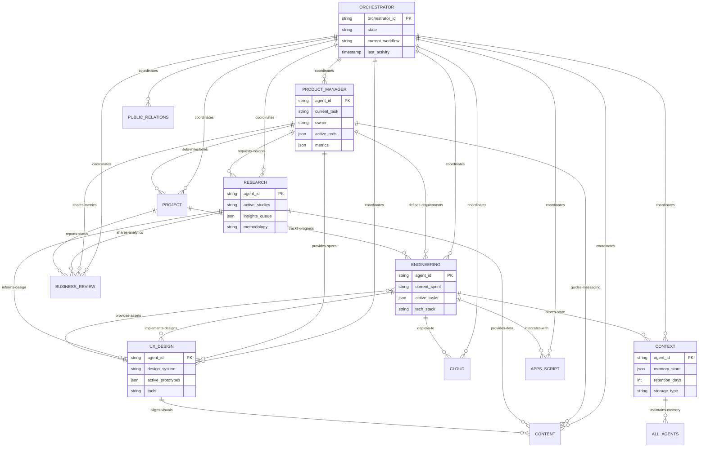
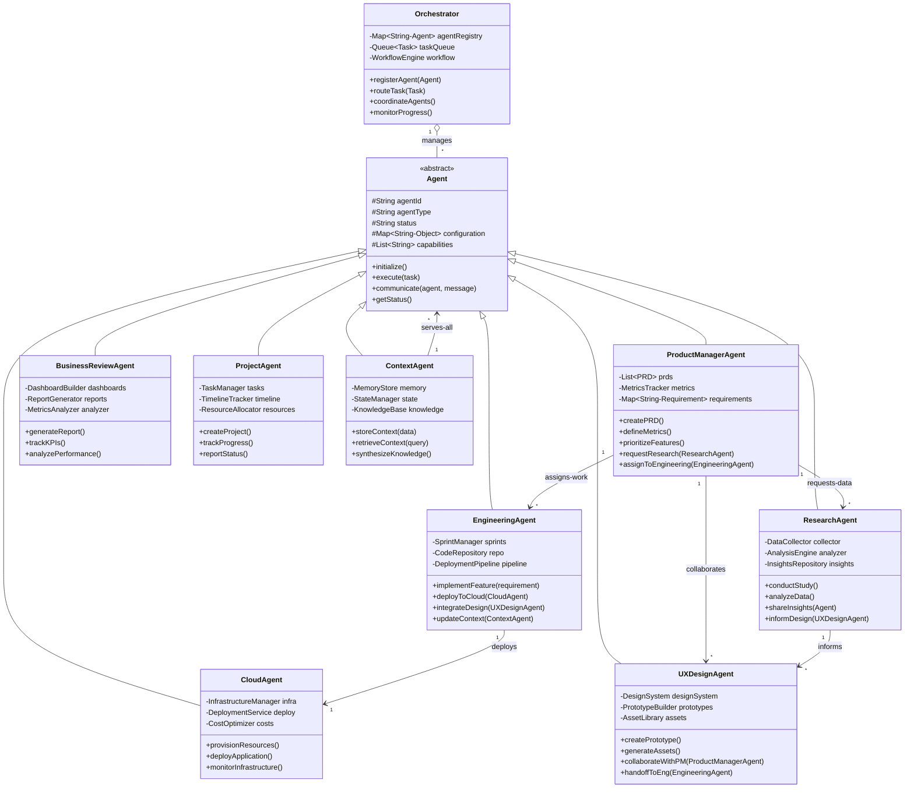
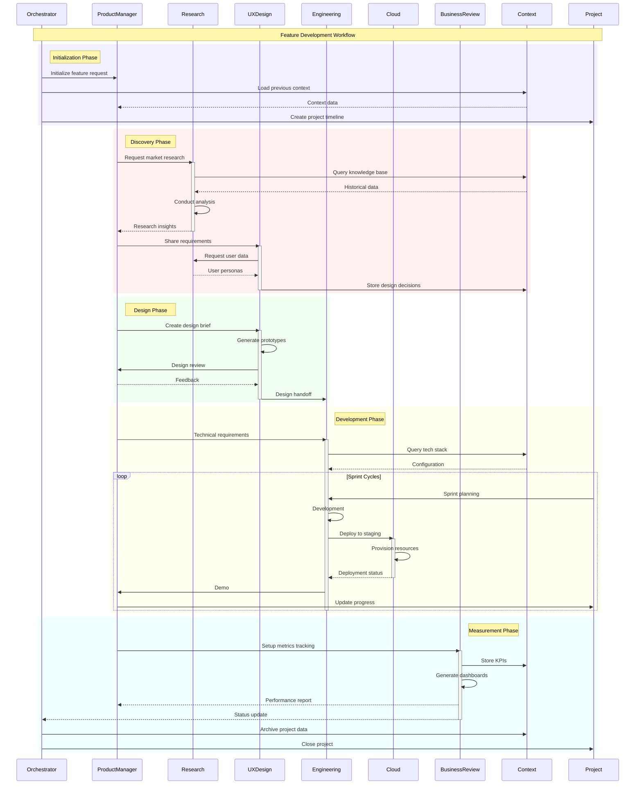

# Agent-to-Agent Relationships

## 1. Entity Relationship Diagram (ERD) - Agent-to-Agent

## 2. Class Diagram - Agent-to-Agent Architecture

## 3. Sequence Diagram - Agent Coordination Flow

---

# Color Legend
- **Blue** (#0000FF): Data flow / Information transfer
- **Green** (#00FF00): Successful operations / Valid paths
- **Red** (#FF0000): Errors / Invalid states
- **Orange** (#FFA500): Control flow / Commands
- **Purple** (#800080): Dependencies / References
