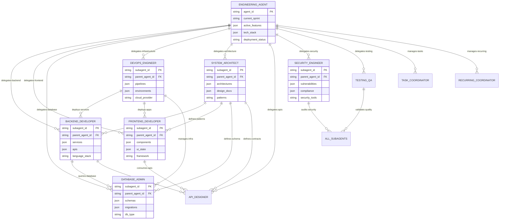
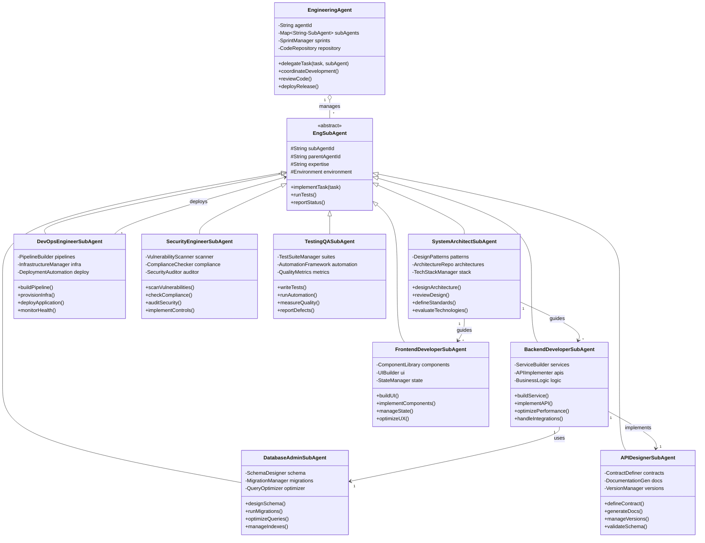
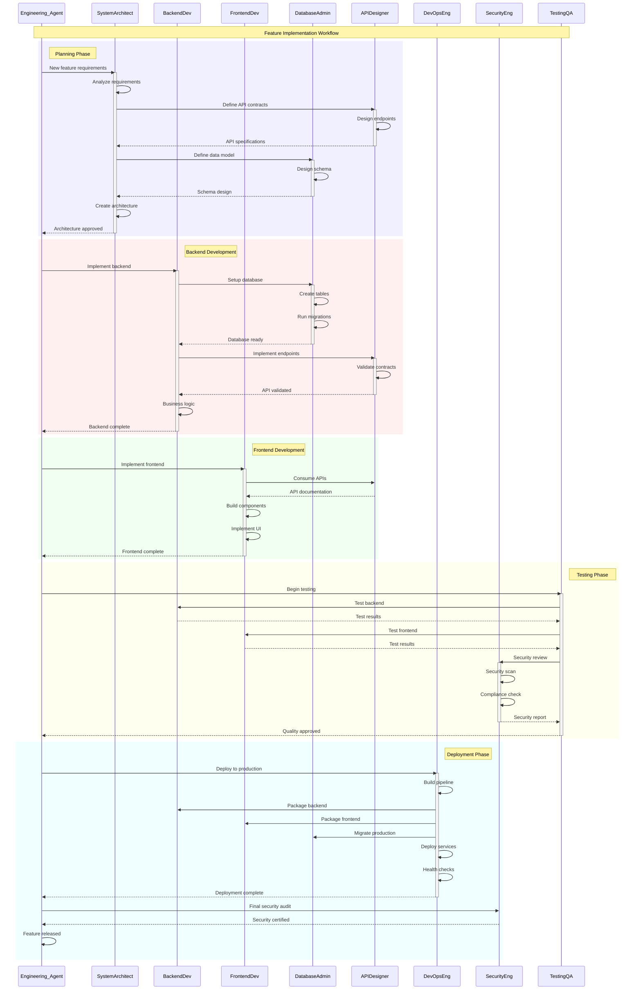

# Engineering Agent - SubAgent Relationships

## 1. Entity Relationship Diagram (ERD) - Engineering Agent to SubAgents

## 2. Class Diagram - Engineering Agent to SubAgent Architecture

## 3. Sequence Diagram - Engineering Agent to SubAgent Workflow

---

# Engineering SubAgent Interactions
- **Blue**: Infrastructure and setup operations
- **Green**: Development and implementation
- **Red**: Critical security and compliance checks
- **Yellow**: Testing and validation
- **Cyan**: Deployment and release
