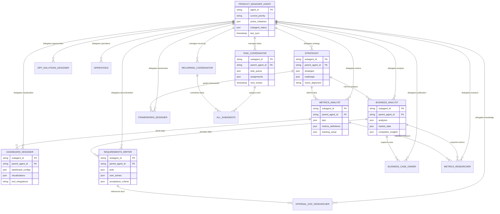
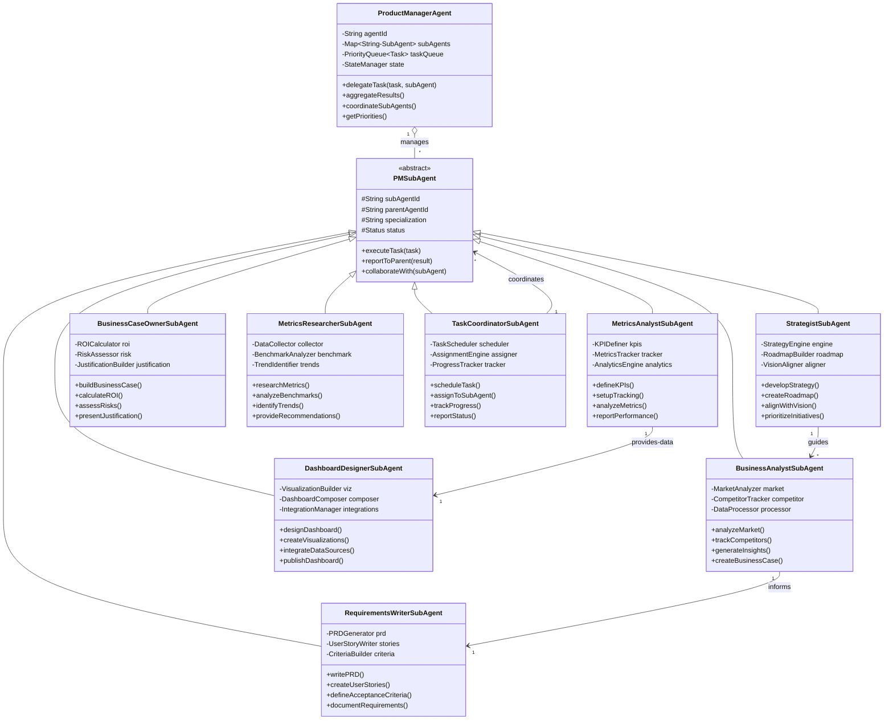
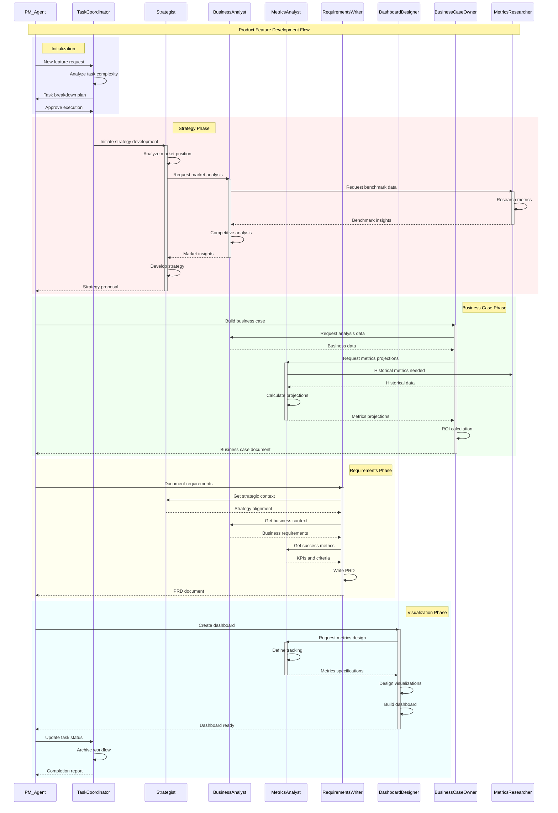

# Product Manager Agent - SubAgent Relationships

## 1. Entity Relationship Diagram (ERD) - PM Agent to SubAgents

## 2. Class Diagram - PM Agent to SubAgent Architecture

## 3. Sequence Diagram - PM Agent to SubAgent Workflow

---

# Color Coding Applied
- **Blue backgrounds** (rgb(240, 240, 255)): Initialization/Setup phases
- **Red backgrounds** (rgb(255, 240, 240)): Critical decision phases
- **Green backgrounds** (rgb(240, 255, 240)): Execution phases
- **Yellow backgrounds** (rgb(255, 255, 240)): Documentation phases
- **Cyan backgrounds** (rgb(240, 255, 255)): Finalization phases
