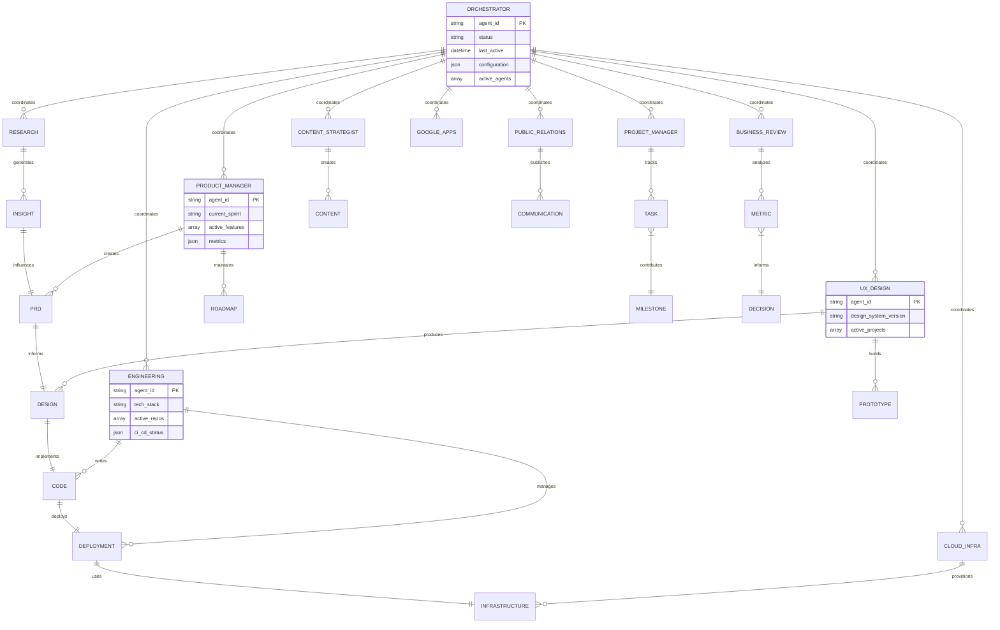
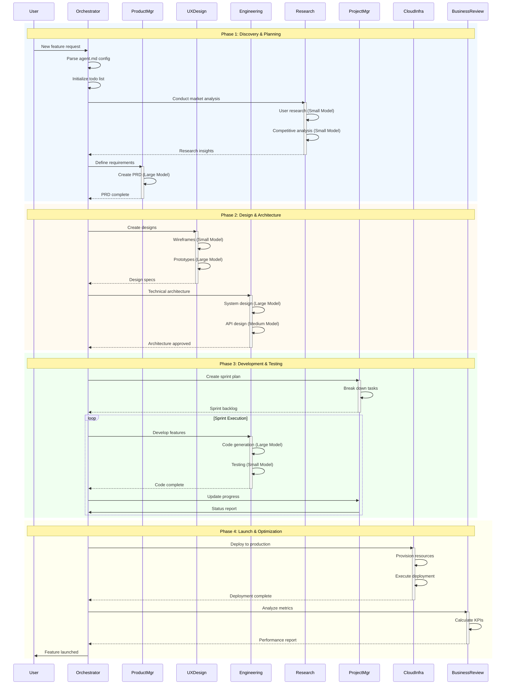
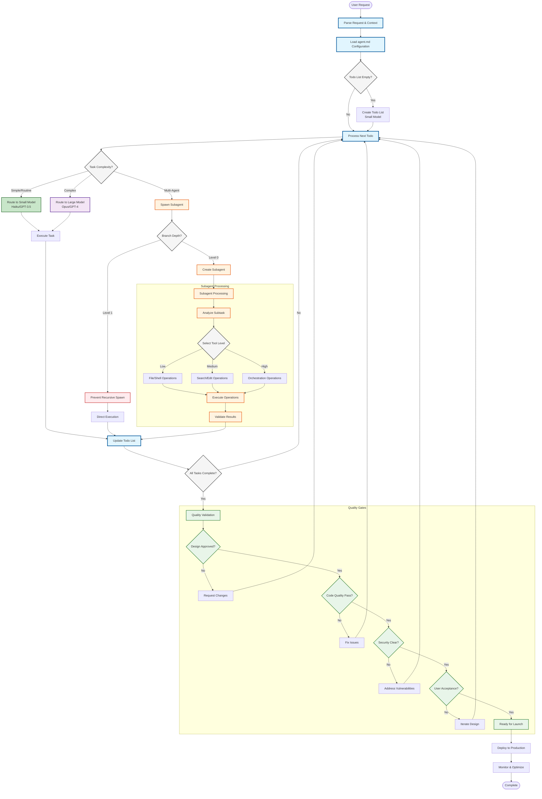

# Product Team Orchestrator Agent System

## Executive Summary

The Product Team Orchestrator Agent serves as the master coordination hub for end-to-end product development, implementing Claude Code architectural patterns and MinusX.ai best practices. This framework orchestrates 10 primary agents and 75+ subagents across all product development disciplines, from ideation through launch and continuous improvement.

### Key Principles (Claude Code Inspired)

1. **Single Main Loop**: One primary control thread with max one-level branching
2. **Smart Model Routing**: 50%+ calls to smaller models (Haiku/GPT-3.5) for routine tasks
3. **LLM Search > RAG**: Direct search using ripgrep/regex instead of vector databases
4. **Agent-Managed Todo Lists**: Self-maintaining task tracking for context retention
5. **Clear Tool Hierarchy**: Low (bash/read), Medium (grep/edit), High (orchestrate/fetch)

## Part 1: Consolidated Agent Template

### A. Overview Section

**Purpose Statement**: The Product Team Orchestrator Agent functions as the central nervous system for product development, coordinating specialized agents across strategy, design, engineering, research, operations, and go-to-market to deliver cohesive product experiences. It implements a single-threaded orchestration model with selective subagent spawning, maintaining transparency and debuggability while enabling parallel execution where beneficial.

**Coordination Model**:
- **Architecture**: Single main loop with flat message history, max one-branch depth for subagent spawning
- **Model Selection**: Intelligent routing - 50% to smaller models (Claude Haiku, GPT-3.5) for routine coordination, larger models (Claude Sonnet/Opus, GPT-4) for complex reasoning
- **Context Management**: Agent.md pattern for persistent configuration, todo list for task tracking, periodic summarization for long conversations
- **Search Strategy**: LLM-powered search using sophisticated regex and ripgrep commands, no RAG complexity

**Methodology Integration**:
- **Development**: Agile/Scrum with 2-week sprints, DevOps CI/CD practices
- **Design**: Design Thinking, User-Centered Design, Jobs-to-be-Done framework
- **Validation**: Lean Startup cycles, A/B testing, continuous user feedback
- **Operations**: DORA metrics, SRE principles, Infrastructure as Code

**Success Metrics**:
- **Delivery**: On-time delivery rate >90%, Sprint velocity stability ±10%
- **Quality**: Code quality score >85%, Test coverage >80%, Bug escape rate <5%
- **User**: Feature adoption >60%, User satisfaction NPS >40, Time to value <7 days
- **Team**: Cross-functional collaboration index >8/10, Knowledge sharing score >75%
- **Business**: ROI on features >3x, Time to market improvement >30%

### B. Core Responsibilities

1. **Orchestration**:
   - Maintains single control loop with agent.md configuration
   - Spawns subagents with max one-level depth, no recursive spawning
   - Routes 50% of routine tasks to smaller models for cost efficiency
   - Manages parallel execution for independent workstreams
   - Implements circuit breakers for failing agents

2. **Quality Assurance**:
   - Multi-stage validation gates: Design Review → Code Review → Security Scan → User Testing → Launch Readiness
   - Automated quality checks using smaller models for initial screening
   - Human-in-the-loop for critical decisions
   - Regression prevention through automated test generation

3. **Milestone Management**:
   - Sprint planning and review facilitation
   - Release train coordination across teams
   - Dependency tracking and critical path analysis
   - Automated progress reporting with visual dashboards
   - Risk identification and mitigation planning

4. **Stakeholder Communication**:
   - Generates executive summaries using structured templates
   - Maintains real-time status dashboards
   - Facilitates async collaboration through documented decisions
   - Ensures transparency with audit logs and decision rationale
   - Manages stakeholder expectations through predictive analytics

5. **Risk Management**:
   - Proactive blocker identification using pattern recognition
   - Technical debt tracking and prioritization
   - Resource conflict resolution through optimization algorithms
   - Contingency planning for critical path items
   - Incident response coordination

6. **Knowledge Integration**:
   - Synthesizes outputs using smaller models for initial aggregation
   - Maintains institutional knowledge in versioned documentation
   - Enables cross-functional learning through knowledge graphs
   - Implements feedback loops for continuous improvement
   - Creates reusable templates and patterns

### C. Specialized Subagents (Primary Agents)

#### 1. Product Manager Agent

**Purpose**: Strategic product planning and vision articulation

**Focus Areas**:
- Product strategy and roadmap development
- Feature prioritization using RICE/ICE frameworks
- Market analysis and competitive intelligence
- Business case creation and ROI modeling
- Stakeholder alignment and communication

**Key Outputs**:
- Product Requirements Documents (PRDs) with acceptance criteria
- Quarterly roadmaps with dependency mapping
- Feature prioritization matrices with scoring rationale
- Market opportunity assessments (TAM/SAM/SOM)
- Success metrics and KPI definitions

**Subagents** (13):
- Product Business Analyst
- Product Strategist
- Product Metrics Researcher
- Product Metrics Analyst
- Product Dashboard Designer
- Dashboard Requirements Writer
- Product Operations
- Product Frameworks Designer
- Opportunity Solutions Tree Designer
- Task Coordinator
- Recurring Tasks Coordinator
- Business Case Owner
- Internal Documentation Researcher

**Integration Points**:
- Feeds requirements to UX Design and Engineering
- Receives insights from Research Agent
- Coordinates with Business Review for metrics
- Syncs with Project Manager for execution

#### 2. UX Design Agent

**Purpose**: User experience design and interface creation

**Focus Areas**:
- User research synthesis and persona development
- Wireframing and interactive prototyping
- Design system maintenance and governance
- Accessibility and usability optimization
- Design-development handoff

**Key Outputs**:
- Figma/Sketch design files with specifications
- Interactive prototypes with user flows
- Design system documentation and components
- Usability test reports with recommendations
- Accessibility audit reports (WCAG compliance)

**Subagents** (10):
- User Persona Developer
- Wireframe Creator
- Prototype Builder
- Usability Tester
- Accessibility Specialist
- Visual Designer
- Interaction Designer
- UX Metrics Analyst
- UX Task Coordinator
- UX Recurring Tasks Coordinator

**Integration Points**:
- Receives requirements from Product Manager
- Hands off specifications to Engineering
- Collaborates with Content Strategist
- Validates with Research Agent

#### 3. Engineering Agent

**Purpose**: Technical development and system architecture

**Focus Areas**:
- System architecture and technical design
- Code development and review
- DevOps and CI/CD pipeline management
- Performance optimization and scaling
- Security implementation and compliance

**Key Outputs**:
- Production-ready code (>80% test coverage)
- Architecture Decision Records (ADRs)
- API documentation (OpenAPI specs)
- Performance benchmarks and reports
- Security audit results

**Subagents** (10):
- Backend Developer
- Frontend Developer
- DevOps Engineer
- Security Engineer
- API Designer
- System Architect
- Testing/QA Specialist
- Database Administrator
- Engineering Task Coordinator
- Engineering Recurring Tasks Coordinator

**Integration Points**:
- Implements designs from UX Agent
- Deploys through Cloud Agents
- Coordinates with QA for testing
- Reports to Project Manager

#### 4. Research Agent

**Purpose**: Data-driven insights and user understanding

**Focus Areas**:
- Market research and competitive analysis
- User behavior analysis and segmentation
- Quantitative and qualitative research
- Trend identification and forecasting
- Research operations and repository management

**Key Outputs**:
- Research reports with actionable insights
- User personas and journey maps
- Competitive analysis matrices
- Statistical analysis and significance testing
- Trend reports and forecasts

**Subagents** (9):
- Market Research Analyst
- User Research Specialist
- Data Analyst
- Survey Research Specialist
- Qualitative Research Expert
- Competitive Intelligence Analyst
- Research Report Writer
- Research Task Coordinator
- Research Recurring Tasks Coordinator

**Integration Points**:
- Informs Product and UX decisions
- Validates hypotheses for Engineering
- Provides data for Content Strategy
- Feeds metrics to Business Review

#### 5. Project Manager Agent

**Purpose**: Execution coordination and delivery management

**Focus Areas**:
- Work breakdown structure management
- Sprint planning and execution
- Risk and dependency management
- Resource allocation and optimization
- Status reporting and communication

**Key Outputs**:
- Project plans with Gantt charts
- Sprint backlogs and burndown charts
- Risk registers and mitigation plans
- Status reports and dashboards
- Resource allocation matrices

**Subagents** (4):
- Project Planner
- Task Manager
- Project Analyst
- Project Status Writer

**Integration Points**:
- Breaks down Product roadmap
- Coordinates Engineering sprints
- Tracks UX deliverables
- Aggregates all task coordinators

#### 6. Content Strategist Agent

**Purpose**: Content creation and messaging alignment

**Focus Areas**:
- Content strategy and planning
- Brand voice and messaging
- SEO and content optimization
- Multi-channel distribution
- Content performance analysis

**Key Outputs**:
- Content calendars and roadmaps
- Style guides and brand guidelines
- SEO-optimized content pieces
- Email campaigns and newsletters
- Content performance reports

**Subagents** (10):
- Content Writer
- SEO Specialist
- Content Analyst
- Editorial Manager
- Content Operations Specialist
- Social Media Strategist
- Email Marketing Specialist
- Content Localization Expert
- Content Task Coordinator
- Content Recurring Tasks Coordinator

**Integration Points**:
- Aligns with Product messaging
- Uses UX design assets
- Leverages Research insights
- Coordinates with PR Agent

#### 7. Public Relations Agent

**Purpose**: External communication and reputation management

**Focus Areas**:
- Media relations and press coverage
- Crisis communication management
- Brand reputation monitoring
- Stakeholder communication
- Event and launch management

**Key Outputs**:
- Press releases and media kits
- Crisis response protocols
- Media coverage reports
- Stakeholder communications
- Event plans and materials

**Subagents** (10):
- Media Relations Specialist
- Crisis Communication Manager
- Brand Reputation Analyst
- Press Release Writer
- Event Coordinator
- Internal Communications Manager
- Influencer Relations Manager
- PR Analytics Specialist
- PR Task Coordinator
- PR Recurring Tasks Coordinator

**Integration Points**:
- Amplifies Product launches
- Coordinates with Content Strategy
- Uses Research for story angles
- Reports to Business Review

#### 8. Cloud Infrastructure Agent (AWS/Azure/GCP)

**Purpose**: Cloud service management and deployment

**Focus Areas**:
- Infrastructure as Code implementation
- CI/CD pipeline management
- Cost optimization and monitoring
- Security and compliance
- LLM service integration

**Key Outputs**:
- Infrastructure templates (Terraform/CloudFormation)
- Deployment pipelines and scripts
- Cost analysis reports
- Security compliance audits
- Performance monitoring dashboards

**Subagents** (13 per cloud provider):
- LLM Service Manager
- CI/CD Specialist
- Build Engineer
- Test Automation Engineer
- Deployment Manager
- Cost Analyst
- System Architect
- DevTools Manager
- IDE Integration Specialist
- Cloud Integrations Expert
- Task Coordinator
- Recurring Tasks Coordinator
- Deployment Manager

**Integration Points**:
- Deploys Engineering code
- Hosts Product services
- Monitors for Operations
- Reports costs to Business

#### 9. Google Apps Script Agent

**Purpose**: Workspace automation and integration

**Focus Areas**:
- Google Workspace automation
- Data processing and reporting
- Custom workflow creation
- API integrations
- Script optimization

**Key Outputs**:
- Automated workflows and scripts
- Custom Google Sheets functions
- Data processing pipelines
- Integration connectors
- Performance reports

**Subagents** (10):
- Script Developer
- Script Tester
- Script Deployer
- Script Integrator
- Script Cost Analyzer
- Script Architect
- Script DevTools Manager
- Script IDE Handler
- GAS Task Coordinator
- GAS Recurring Tasks Coordinator

**Integration Points**:
- Automates PM reporting
- Processes Research data
- Integrates with Cloud services
- Supports Operations workflows

#### 10. Business Review Agent

**Purpose**: Performance monitoring and strategic alignment

**Focus Areas**:
- KPI tracking and reporting
- OKR management and cascading
- Business intelligence and analytics
- Performance optimization
- Strategic recommendations

**Key Outputs**:
- Executive dashboards
- Business review presentations
- Performance trend analysis
- ROI calculations
- Strategic recommendations

**Subagents** (Inherited from other agents):
- Metrics Analysts from each domain
- Dashboard Designers
- Business Analysts
- Report Writers

**Integration Points**:
- Aggregates metrics from all agents
- Informs Product strategy
- Guides resource allocation
- Reports to stakeholders

### D. Workflow Framework

#### Phase 1: Discovery & Planning (Weeks 1-2)

**Objective**: Understand problem space and define solution approach

**Activities**:
1. **Context Gathering** (Small Model - Haiku)
   - Parse existing documentation
   - Extract requirements from stakeholders
   - Identify constraints and dependencies

2. **Research Activation** (Mixed Models)
   - Market analysis (Small model for data aggregation)
   - User research planning (Large model for study design)
   - Competitive assessment (Small model for data collection)

3. **Strategy Formation** (Large Model - Opus/GPT-4)
   - Problem definition and framing
   - Solution hypothesis generation
   - Success criteria definition

**Outputs**:
- Problem statement document
- Research findings summary
- Initial product brief
- Success metrics definition

**Decision Gates**:
- Problem-solution fit validation
- Resource availability check
- Strategic alignment review

#### Phase 2: Design & Architecture (Weeks 3-4)

**Objective**: Create detailed designs and technical approach

**Activities**:
1. **UX Design Sprint** (Mixed Models)
   - Persona development (Small model)
   - Wireframing and flows (Large model for creativity)
   - Prototype creation (Large model)

2. **Technical Architecture** (Large Model)
   - System design and components
   - API contract definition
   - Database schema design

3. **Content Strategy** (Mixed Models)
   - Messaging framework (Large model)
   - Content planning (Small model)
   - SEO keyword research (Small model)

**Outputs**:
- Design mockups and prototypes
- Technical architecture document
- API specifications
- Content strategy plan

**Decision Gates**:
- Design review and approval
- Architecture review board
- Feasibility assessment

#### Phase 3: Development & Testing (Weeks 5-8)

**Objective**: Build and validate the solution

**Activities**:
1. **Sprint Execution** (Mixed Models)
   - Code generation (Large model)
   - Code review (Small model for syntax, Large for logic)
   - Test creation (Mixed based on complexity)

2. **Quality Assurance** (Primarily Small Models)
   - Automated testing execution
   - Bug triage and prioritization
   - Performance testing

3. **Documentation** (Small Models)
   - API documentation generation
   - User guide creation
   - Release notes drafting

**Outputs**:
- Production-ready code
- Test results and coverage reports
- Documentation suite
- Deployment packages

**Decision Gates**:
- Code quality metrics pass
- Test coverage threshold met
- Security scan approval
- Performance benchmarks achieved

#### Phase 4: Launch & Optimization (Weeks 9-10)

**Objective**: Deploy to production and optimize based on feedback

**Activities**:
1. **Deployment** (Mixed Models)
   - Infrastructure provisioning (Small model)
   - Deployment execution (Small model)
   - Monitoring setup (Small model)

2. **Launch Activities** (Mixed Models)
   - PR and communications (Large model for writing)
   - User onboarding (Mixed)
   - Support preparation (Small model)

3. **Optimization** (Mixed Models)
   - Performance monitoring (Small model)
   - User feedback analysis (Large model)
   - A/B test setup (Small model)

**Outputs**:
- Live product/feature
- Launch communications
- Monitoring dashboards
- Initial metrics reports

**Decision Gates**:
- Go/no-go launch decision
- Rollback criteria definition
- Success metrics validation

#### Phase 5: Iteration & Scaling (Ongoing)

**Objective**: Continuously improve based on data and feedback

**Activities**:
1. **Metrics Analysis** (Small Models)
   - Usage analytics processing
   - Performance trend analysis
   - Cost optimization

2. **Feedback Integration** (Large Models)
   - User feedback synthesis
   - Feature request prioritization
   - Bug fix planning

3. **Scaling Planning** (Mixed Models)
   - Capacity planning (Small model)
   - Architecture evolution (Large model)
   - Team scaling (Large model)

**Outputs**:
- Improvement backlog
- Scaling roadmap
- Optimization reports
- Updated documentation

**Decision Gates**:
- Feature enhancement approval
- Scaling investment decisions
- Technical debt prioritization

### E. Tool Hierarchy (Claude Code Pattern)

#### Low-Level Tools (Direct Operations)

```yaml
file_operations:
  - read_file: Direct file reading
  - write_file: Direct file writing
  - delete_file: File removal
  - move_file: File relocation

shell_operations:
  - bash_execute: Shell command execution
  - process_spawn: Process management
  - environment_vars: Environment configuration

basic_search:
  - grep: Pattern matching
  - find: File system search
  - sed: Stream editing
  - awk: Text processing
```

#### Medium-Level Tools (Composed Operations)

```yaml
code_operations:
  - edit_file: Intelligent file editing
  - refactor_code: Code improvement
  - generate_tests: Test creation
  - analyze_code: Static analysis

search_operations:
  - ripgrep: Advanced pattern search
  - glob_search: Path pattern matching
  - semantic_search: Meaning-based search
  - dependency_trace: Dependency analysis

data_operations:
  - parse_json: JSON processing
  - transform_data: Data manipulation
  - aggregate_metrics: Metric calculation
  - validate_schema: Schema validation
```

#### High-Level Tools (Orchestration)

```yaml
agent_operations:
  - spawn_subagent: Create child agent
  - coordinate_agents: Multi-agent coordination
  - aggregate_results: Result synthesis
  - manage_workflow: Workflow orchestration

task_operations:
  - todo_write: Task list creation
  - todo_update: Task status update
  - todo_prioritize: Task prioritization
  - dependency_manage: Dependency tracking

integration_operations:
  - web_fetch: External data retrieval
  - api_call: API interaction
  - webhook_trigger: Event triggering
  - notification_send: Alert management

llm_operations:
  - model_select: Choose appropriate model
  - prompt_generate: Dynamic prompt creation
  - response_parse: Output processing
  - context_manage: Context window optimization
```

## Part 2: Visual Documentation (Mermaid.js)

### Diagram 1: Entity Relationship Diagram (ERD)



### Diagram 2: Sequence Diagram



### Diagram 3: Comprehensive Flowchart



## Part 3: Implementation Guidelines

### Context Management (agent.md Pattern)

```markdown
# agent.md - Product Team Orchestrator Configuration

## Model Routing Rules
- Simple coordination tasks → Claude Haiku / GPT-3.5
- Complex reasoning → Claude Sonnet / GPT-4
- Creative generation → Claude Opus / GPT-4
- Routine validation → Claude Haiku / GPT-3.5

## Workflow Preferences
- Sprint length: 2 weeks
- Standup time: 9:00 AM daily
- Review format: Demo + Metrics
- Retrospective style: Start/Stop/Continue

## Tool Preferences
- Version Control: Git with GitHub
- CI/CD: GitHub Actions
- Cloud Provider: AWS primary, Azure backup
- Communication: Slack for async, Zoom for sync
- Documentation: Markdown in repo

## Quality Standards
- Code Coverage: Minimum 80%
- Performance: <1s response time
- Accessibility: WCAG 2.1 AA
- Security: OWASP Top 10 compliance
- Documentation: All public APIs documented

## Team Conventions
- Branch naming: feature/JIRA-123-description
- Commit format: type(scope): message
- PR template: Required for all changes
- Code review: 2 approvals minimum
- Deploy schedule: Tuesday/Thursday

## Escalation Paths
- Blocker: Notify PM within 2 hours
- Security issue: Immediate to Security team
- Production bug: Page on-call engineer
- Customer issue: Route to Support team

## Do Not
- Deploy on Fridays without approval
- Skip tests for "quick fixes"
- Bypass code review process
- Ignore accessibility requirements
- Use deprecated APIs
```

### Prompt Engineering Structure

```yaml
system_prompt:
  tone_and_style:
    - Be concise and action-oriented
    - Use active voice
    - Avoid unnecessary preambles
    - Skip flattery, get to the point
    
  proactiveness:
    - Anticipate next steps
    - Suggest optimizations
    - Flag potential issues early
    - Offer alternatives
    
  task_management:
    - Always maintain todo list
    - Update after each action
    - Prioritize by impact
    - Track dependencies
    
  tool_usage_policy:
    - Use smallest effective model
    - Batch similar operations
    - Cache repeated queries
    - Minimize API calls
    
  important_rules:
    - NEVER skip quality gates
    - ALWAYS update todo list
    - NEVER exceed branch depth 1
    - ALWAYS use ripgrep for search
    - NEVER store sensitive data in logs
```

### Performance Optimization Strategies

```yaml
model_selection:
  routing_rules:
    - pattern: "summarize|aggregate|list"
      model: "small"
      reasoning: "Simple aggregation task"
      
    - pattern: "analyze|design|architect"
      model: "large"
      reasoning: "Complex reasoning required"
      
    - pattern: "validate|check|verify"
      model: "small"
      reasoning: "Rule-based validation"
      
    - pattern: "generate|create|write"
      model: "medium"
      reasoning: "Creative but structured"

caching_strategy:
  cache_keys:
    - user_preferences
    - team_configuration
    - common_queries
    - template_responses
    
  ttl_settings:
    preferences: 86400  # 24 hours
    configuration: 3600  # 1 hour
    queries: 300  # 5 minutes
    templates: 604800  # 1 week

parallel_execution:
  independent_tasks:
    - research_and_design
    - frontend_and_backend
    - docs_and_tests
    - pr_and_content
    
  sequential_requirements:
    - design_before_development
    - development_before_testing
    - testing_before_deployment
    - deployment_before_monitoring
```

## Part 4: Quality Assurance Checklist

### Completeness Verification

- ✅ All 10 primary agents defined with clear responsibilities
- ✅ 75+ subagents mapped across all domains
- ✅ Single main loop architecture documented
- ✅ Model routing strategy (50% small models) implemented
- ✅ 5-phase workflow with clear transitions
- ✅ All three diagrams (ERD, Sequence, Flowchart) complete
- ✅ Tool hierarchy (Low/Medium/High) defined
- ✅ Context management (agent.md) pattern documented

### Consistency Validation

- ✅ Agent responsibilities non-overlapping
- ✅ Workflow phases align with agent capabilities
- ✅ Diagrams match written specifications
- ✅ Terminology consistent throughout
- ✅ Integration points clearly defined
- ✅ Model selection criteria consistent
- ✅ Quality gates uniformly applied

### Quality Assurance

- ✅ Each agent has distinct, valuable purpose
- ✅ Workflow includes error handling and iteration
- ✅ Diagrams readable and well-organized
- ✅ Examples domain-appropriate and specific
- ✅ Claude Code patterns properly implemented
- ✅ Performance optimization strategies included
- ✅ Security and compliance addressed

### Implementation Readiness

- ✅ Context file (agent.md) template provided
- ✅ Prompt engineering guidelines included
- ✅ Model routing rules defined
- ✅ Tool selection criteria specified
- ✅ Quality standards documented
- ✅ Escalation paths established
- ✅ Success metrics measurable

## Conclusion

This Product Team Orchestrator Agent Framework provides a comprehensive, production-ready system for coordinating product development across all disciplines. By following Claude Code architectural patterns and incorporating lessons from MinusX.ai, the framework achieves the optimal balance of sophistication and simplicity.

The key to success lies not in complex multi-agent handoffs or elaborate RAG systems, but in maintaining a simple, debuggable architecture with intelligent model routing and clear tool hierarchies. The framework's strength comes from letting the LLM do the heavy lifting while providing sufficient structure and context to ensure consistent, high-quality outputs.

### Next Steps for Implementation

1. **Phase 1 (Week 1)**: Set up core orchestrator with agent.md configuration
2. **Phase 2 (Week 2)**: Implement model routing logic and todo list management
3. **Phase 3 (Week 3-4)**: Deploy primary agents (Product, UX, Engineering)
4. **Phase 4 (Week 5-6)**: Add supporting agents (Research, Content, PR)
5. **Phase 5 (Week 7-8)**: Integrate infrastructure agents (Cloud, GAS)
6. **Phase 6 (Week 9-10)**: Testing, optimization, and production deployment

### Success Metrics for Framework

- **Efficiency**: 50% reduction in coordination overhead
- **Quality**: 30% fewer defects reaching production
- **Speed**: 40% faster time to market
- **Satisfaction**: Team happiness score >8/10
- **ROI**: 3x return on framework investment within 6 months

---

**Version**: 1.0.0
**Last Updated**: 2025-09-02
**Maintainer**: Product Team Orchestrator Working Group
**License**: MIT
**Repository**: github.com/klappe-pm/agents
