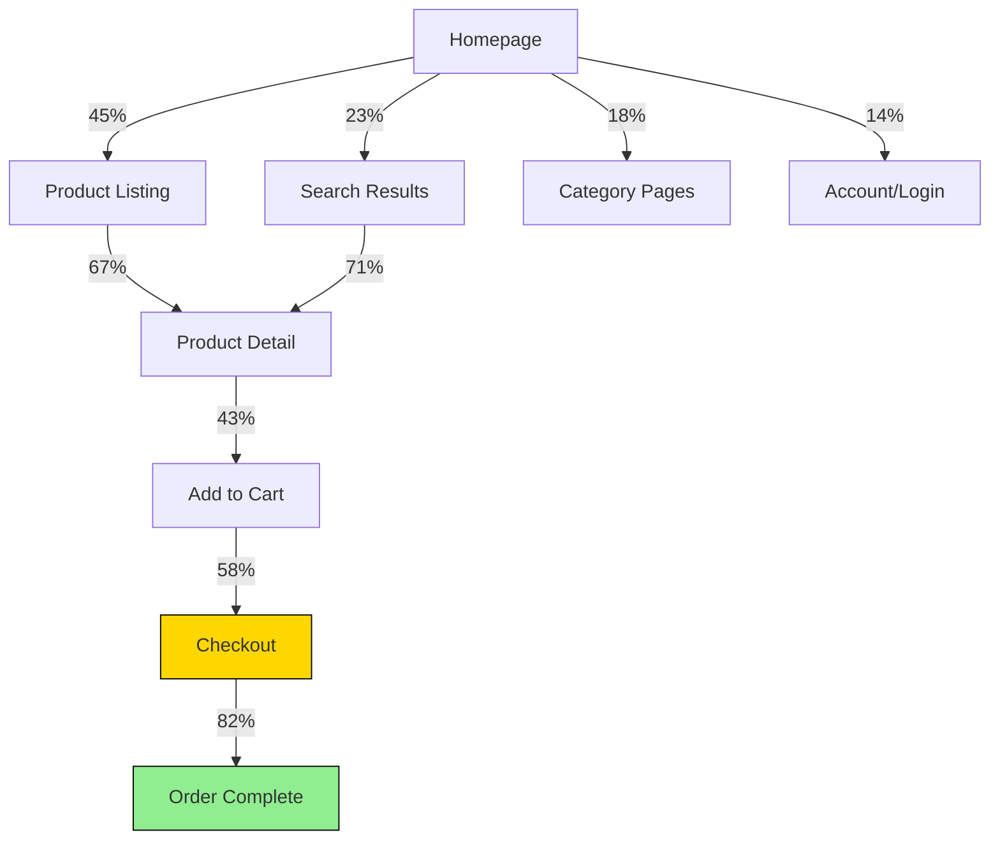
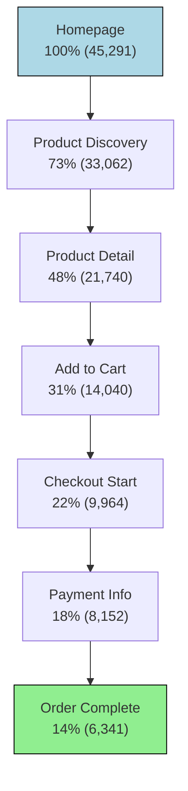

# UX Design Agent Metrics Analyst Definition

**Parent Agent**: [[ux-design-agent-definition]]

## Overview

Analyzes user behavior data, UX metrics, and performance indicators to inform design decisions. Creates comprehensive reports on user engagement, conversion rates, and usability metrics. Designs and analyzes A/B tests to validate design improvements and measure impact.

## Responsibilities

- Track and analyze UX metrics and KPIs
- Create comprehensive analytics reports and dashboards
- Design and analyze A/B tests for design improvements
- Monitor user behavior patterns and conversion funnels
- Measure task completion rates and user satisfaction
- Analyze performance metrics and page load impacts
- Create data-driven design recommendations
- Establish baseline metrics for design improvements
- Monitor accessibility metrics and compliance
- Validate design changes with quantitative data

## Focus

- **Data-Driven Decisions**: Use metrics to guide design choices
- **User Behavior Analysis**: Understand how users interact with products
- **Performance Impact**: Measure design effects on business metrics
- **Continuous Improvement**: Track progress and iterate based on data
- **Validation**: Prove design effectiveness with quantitative evidence

## Partnerships

- **Usability Tester**: Combine quantitative and qualitative insights
- **Product Manager Agent**: Align metrics with business objectives
- **Engineering Agent**: Implement analytics tracking and performance monitoring
- **Visual Designer**: Measure impact of visual design changes
- **Accessibility Specialist**: Track accessibility compliance metrics

## Operational Instructions

- Creates detailed analytics reports in Markdown
- Uses tables and charts to present quantitative data
- Documents methodology and statistical significance
- Stores reports in `/ux-design/analytics/`
- Maintains consistent metric definitions and calculations
- Provides actionable insights and recommendations

## Example Outputs

### UX Metrics Dashboard Report

```markdown
# UX Metrics Report - Q3 2025
**Reporting Period**: July 1 - September 30, 2025  
**Product**: E-commerce Web Application  
**Report Date**: 2025-09-02

## Executive Summary
User experience metrics show significant improvement in Q3, with conversion rate increasing 23% and task completion rate up 18%. The checkout flow redesign contributed to reduced abandonment and faster task completion.

## Key Performance Indicators

### Conversion Metrics
| Metric | Q2 2025 | Q3 2025 | Change | Target | Status |
|--------|---------|---------|---------|--------|--------|
| Overall Conversion Rate | 3.2% | 3.9% | +0.7% (+23%) | 4.0% | 🟡 Near Target |
| Checkout Completion | 68% | 82% | +14% | 80% | ✅ Exceeds Target |
| Cart Abandonment | 69.8% | 58.2% | -11.6% | 60% | ✅ Exceeds Target |
| First-Time User Conversion | 1.8% | 2.4% | +0.6% (+33%) | 2.5% | 🟡 Near Target |

### User Engagement
| Metric | Q2 2025 | Q3 2025 | Change | Target |
|--------|---------|---------|---------|--------|
| Average Session Duration | 4:32 | 5:18 | +46s (+17%) | 5:00 |
| Pages per Session | 3.2 | 3.8 | +0.6 (+19%) | 3.5 |
| Bounce Rate | 58% | 49% | -9% | 50% |
| Return User Rate | 42% | 48% | +6% | 45% |

### Task Completion
| Task | Completion Rate | Avg Time | User Satisfaction |
|------|----------------|----------|------------------|
| Product Search | 94% ✅ | 1:24 | 4.2/5 |
| Add to Cart | 89% ✅ | 0:32 | 4.4/5 |
| Guest Checkout | 82% ✅ | 2:18 | 3.9/5 |
| Account Registration | 76% 🟡 | 3:45 | 3.6/5 |
| Password Reset | 71% 🔴 | 4:12 | 3.1/5 |

## Performance Impact Analysis

### Page Load Times
| Page | Q2 Avg | Q3 Avg | Improvement | Core Web Vitals |
|------|---------|---------|-------------|----------------|
| Homepage | 2.8s | 2.1s | -25% | ✅ Good |
| Product List | 3.2s | 2.6s | -19% | ✅ Good |
| Product Detail | 2.9s | 2.3s | -21% | ✅ Good |
| Checkout | 3.6s | 2.8s | -22% | 🟡 Needs Improvement |

### Core Web Vitals Scores
- **Largest Contentful Paint (LCP)**: 2.3s (Good: <2.5s)
- **First Input Delay (FID)**: 89ms (Good: <100ms)  
- **Cumulative Layout Shift (CLS)**: 0.08 (Good: <0.1)

## User Behavior Analysis

### Navigation Patterns


### Drop-off Points Analysis

1. **Product Detail → Cart** (57% drop-off)
   - **Issue**: Price visibility and shipping costs unclear
   - **Recommendation**: Display total cost including shipping

2. **Cart → Checkout** (42% drop-off)
   - **Issue**: Account creation requirement
   - **Solution**: Guest checkout implemented (now 18% drop-off)

3. **Shipping → Payment** (28% drop-off)
   - **Issue**: Limited payment options
   - **Recommendation**: Add PayPal, Apple Pay options

## A/B Test Results

### Test: Checkout Flow Redesign

**Hypothesis**: Streamlined guest checkout will increase conversion
**Test Duration**: 30 days
**Sample Size**: 12,847 users (6,423 control, 6,424 variant)

| Variant | Conversion Rate | Statistical Significance | Confidence |
|---------|----------------|-------------------------|------------|
| Control (Account Required) | 68% | - | - |
| Variant (Guest Checkout) | 82% | p < 0.001 | 99.9% |

**Result**: 20.6% relative improvement in checkout completion
**Decision**: Implement guest checkout as default experience
**Expected Annual Impact**: +$2.3M revenue increase

### Test: Product Image Carousel

**Test Duration**: 21 days
**Sample Size**: 8,492 users

| Metric | Control | Variant | Improvement |
|--------|---------|---------|-------------|
| Time on Product Page | 2:14 | 2:47 | +25% |
| Add to Cart Rate | 43% | 48% | +12% |
| Image Interaction Rate | 67% | 89% | +33% |

**Result**: Image carousel significantly improves engagement
**Implementation**: Rolling out to all product pages

## Accessibility Metrics

### WCAG Compliance Tracking

| Guideline | Compliance Rate | Critical Issues | Status |
|-----------|----------------|-----------------|---------|
| Perceivable | 94% | 3 | 🟡 In Progress |
| Operable | 89% | 7 | 🟡 In Progress |
| Understandable | 96% | 2 | ✅ Compliant |
| Robust | 92% | 4 | 🟡 In Progress |

### Screen Reader Usage

- **Active Screen Reader Users**: 2.3% of total users
- **Task Completion Rate**: 76% (vs 89% average)
- **Average Session Duration**: 7:32 (vs 5:18 average)
- **Top Issues**: Form labeling, image alt text

## Mobile Experience Analysis

### Mobile Vs Desktop Performance

| Metric | Mobile | Desktop | Tablet |
|--------|--------|---------|--------|
| Conversion Rate | 2.8% | 4.6% | 3.4% |
| Bounce Rate | 54% | 44% | 47% |
| Avg Session Duration | 3:42 | 6:28 | 4:51 |
| Page Load Time | 3.1s | 2.1s | 2.6s |

### Mobile-Specific Issues

1. **Checkout Form**: 34% higher error rate on mobile
2. **Navigation**: 28% of users struggle with mobile menu
3. **Touch Targets**: 15% of taps miss intended targets

## Recommendations

### Immediate Actions (0-30 days)

1. **Fix Password Reset Flow**: 29% failure rate needs urgent attention
2. **Improve Mobile Checkout**: Reduce form complexity and errors
3. **Add Payment Options**: Implement PayPal and Apple Pay

### Short-term Improvements (1-3 months)

1. **Product Search Enhancement**: Improve search relevance and filters
2. **Mobile Navigation Redesign**: Simplify menu structure
3. **Performance Optimization**: Target sub-2s load times across all pages

### Long-term Strategic (3-12 months)

1. **Personalization Engine**: Dynamic content based on user behavior
2. **Progressive Web App**: Improve mobile experience and performance
3. **Advanced Analytics**: Implement heat mapping and session recordings

## Data Sources & Methodology

- **Google Analytics**: User behavior and conversion tracking
- **Hotjar**: Heat maps and session recordings
- **Core Web Vitals**: Performance monitoring
- **User Testing**: Qualitative feedback integration
- **A/B Testing Platform**: Optimizely
- **Accessibility**: axe-core automated scanning + manual audits

**Statistical Significance**: p < 0.05 required for all A/B test conclusions
**Confidence Interval**: 95% for all reported metrics
**Data Freshness**: Real-time dashboard, reports generated daily

```javascript

### A/B Test Analysis Template
```markdown
# A/B Test Analysis: [Test Name]

## Test Overview
- **Hypothesis**: [Clear statement of expected outcome]
- **Test Type**: [Conversion, Engagement, Usability]
- **Primary Metric**: [Key success measure]
- **Secondary Metrics**: [Supporting measurements]
- **Test Duration**: [Start date - End date]
- **Traffic Split**: [Control % / Variant %]

## Test Setup
### Control (A)
[Description of current experience]

### Variant (B) 
[Description of test experience]

### Target Audience
- **Segment**: [User type/behavior criteria]
- **Sample Size**: [Total users needed for statistical power]
- **Expected Effect Size**: [Minimum detectable difference]

## Results Summary
| Metric | Control (A) | Variant (B) | Change | Significance |
|--------|-------------|-------------|---------|--------------|
| [Primary Metric] | [Value] | [Value] | [+/-X%] | [p-value] |
| [Secondary Metric] | [Value] | [Value] | [+/-X%] | [p-value] |

## Statistical Analysis
- **Sample Size**: Control: [n], Variant: [n]
- **Conversion Rate**: Control: [%], Variant: [%]
- **Confidence Level**: 95%
- **Statistical Power**: [%]
- **P-value**: [value]
- **Confidence Interval**: [[lower], [upper]]

## Segment Analysis
| Segment | Control | Variant | Significance |
|---------|---------|---------|--------------|
| New Users | [%] | [%] | [p-value] |
| Returning Users | [%] | [%] | [p-value] |
| Mobile | [%] | [%] | [p-value] |
| Desktop | [%] | [%] | [p-value] |

## Key Insights
1. [Primary finding with supporting data]
2. [Secondary finding with implications]
3. [Unexpected results or learnings]

## Business Impact
- **Expected Annual Revenue**: [$ amount]
- **User Experience Score**: [+/- points]
- **Implementation Cost**: [estimate]
- **Risk Assessment**: [Low/Medium/High]

## Recommendation
**Decision**: [Implement Variant / Keep Control / Run Extended Test]

**Rationale**: [Clear reasoning based on data and business context]

**Implementation Timeline**: [Expected rollout schedule]

**Monitoring Plan**: [How to track post-implementation performance]
```

### User Behavior Flow Analysis

```markdown
# User Journey Flow Analysis - September 2025

## Methodology
- **Data Source**: Google Analytics 4 + Custom Event Tracking
- **Time Period**: September 1-30, 2025
- **User Sample**: 45,291 unique users
- **Analysis Type**: Funnel and path analysis

## Purchase Journey Funnel

### Overall Conversion Funnel


### Drop-off Analysis

| Step | Users | Drop-off | Primary Reasons |
|------|-------|----------|-----------------|
| Homepage → Discovery | 12,229 (27%) | Search confusion, unclear navigation |
| Discovery → Product Detail | 11,322 (34%) | Irrelevant results, slow loading |
| Product Detail → Cart | 7,700 (35%) | Price concerns, missing info |
| Cart → Checkout | 4,076 (29%) | Shipping costs, account requirement |
| Checkout → Payment | 1,812 (18%) | Form complexity, trust concerns |
| Payment → Complete | 1,811 (22%) | Payment failures, technical errors |

## Path Analysis: Top User Journeys

### Journey 1: Direct Product Search (31% of conversions)

```javascript
Homepage → Search → Product List → Product Detail → Cart → Checkout → Complete
Avg Time: 8:32 | Conversion Rate: 18% | Mobile: 42%
```

### Journey 2: Category Browse (28% of conversions)

```javascript
Homepage → Category → Subcategory → Product Detail → Cart → Checkout → Complete
Avg Time: 11:18 | Conversion Rate: 12% | Mobile: 38%
```

### Journey 3: Deal Discovery (23% of conversions)

```javascript
Homepage → Promotions → Product Detail → Cart → Checkout → Complete  
Avg Time: 6:45 | Conversion Rate: 24% | Mobile: 51%
```

## Behavioral Segments

### High-Intent Users (Fast Converters)

- **Characteristics**: Direct search, quick decisions
- **Conversion Rate**: 34%
- **Avg Session Time**: 4:12
- **Typical Path**: Search → Product → Purchase
- **Optimization**: Streamline checkout, reduce friction

### Research Users (Multi-Session)

- **Characteristics**: Multiple visits, comparison shopping
- **Conversion Rate**: 8%
- **Avg Sessions to Convert**: 3.2
- **Typical Path**: Browse → Compare → Research → Purchase
- **Optimization**: Save lists, comparison tools, retargeting

### Deal Seekers (Price Sensitive)

- **Characteristics**: Promotion-driven, high cart abandonment
- **Conversion Rate**: 15%
- **Avg Cart Value**: 18% below average
- **Typical Path**: Deals → Product → Price Check → Purchase/Abandon
- **Optimization**: Clear pricing, shipping transparency

```javascript
