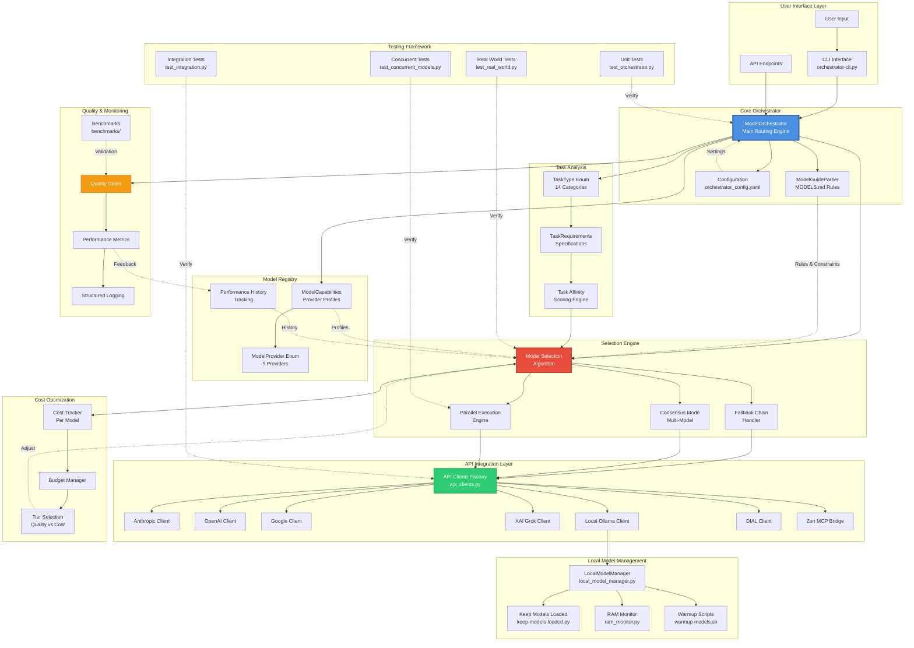
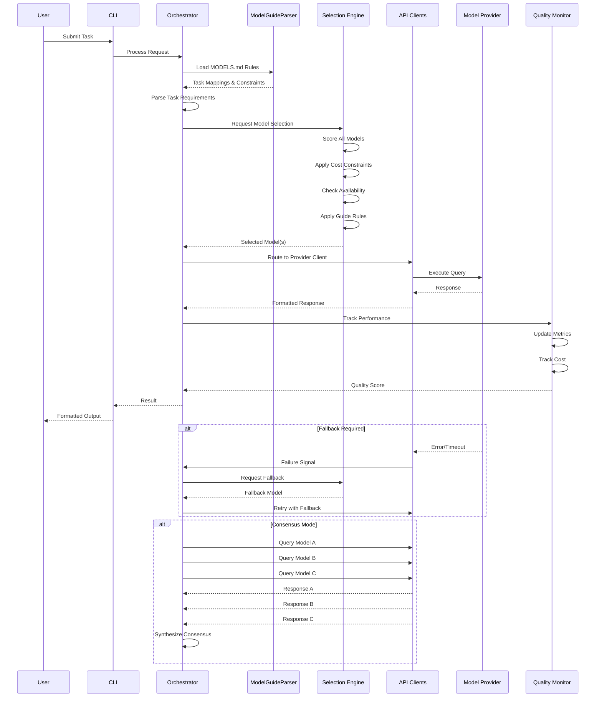
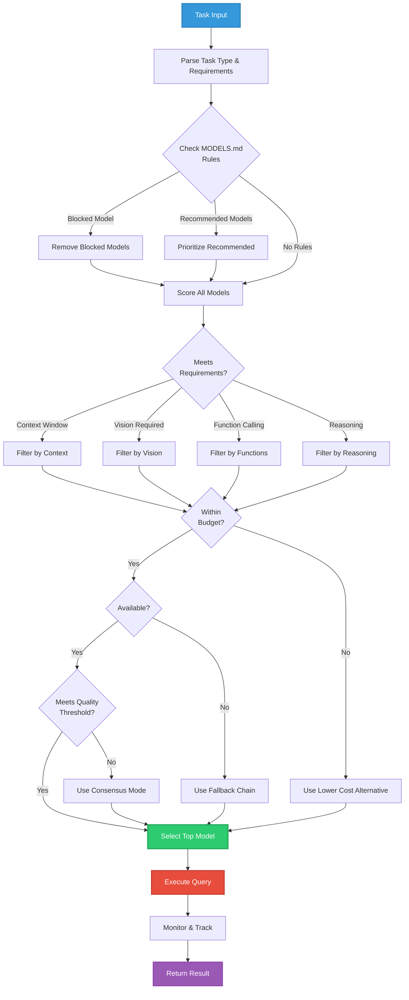

```text

┌─────────────────────────────────────────────┐
│           Orchestrator CLI & API            │
└─────────────────┬───────────────────────────┘
                  │
        ┌─────────▼─────────┐
        │   Intelligent     │
        │   Model Router    │
        └─────────┬─────────┘
                  │
    ┌─────────────┼─────────────┐
    │             │             │
┌───▼────┐ ┌─────▼─────┐ ┌─────▼────┐
│ Cost   │ │   Task    │ │Capability│
│Tracker │ │ Analyzer  │ │Matcher   │
└───┬────┘ └─────┬─────┘ └─────┬────┘
    │            │             │
┌───▼────────────▼─────────────▼────┐
│         63 Models Across          │
│  ┌──────┐┌──────┐┌──────┐┌──────┐ │
│  │Local ││OpenAI││Claude││Grok  │ │
│  │(20)  ││(11)  ││(7)   ││(5)   │ │
│  └──────┘└──────┘└──────┘└──────┘ │
│  ┌──────┐┌──────┐┌──────┐┌──────┐ │
│  │Google││Azure ││Bedrk ││DIAL  │ │
│  │(6)   ││(4)   ││(8)   ││(2)   │ │
│  └──────┘└──────┘└──────┘└──────┘ │
└───────────────────────────────────┘

```


## Detailed Component Flow



## Model Selection Decision Tree
