# Power Prompts Model Architecture

**63 AI Models Across 8 Providers**

```mermaid
graph LR
    Client[Power Prompts Orchestrator]
    
    Client --> Local[🏠 Local/Ollama<br/>20 Models - FREE]
    Client --> OpenAI[🤖 OpenAI<br/>11 Models]
    Client --> Bedrock[☁️ Amazon Bedrock<br/>8 Models]
    Client --> Anthropic[🧠 Anthropic<br/>7 Models]
    Client --> Google[🔍 Google Gemini<br/>6 Models]
    Client --> XAI[⚡ xAI Grok<br/>5 Models]
    Client --> Azure[🏢 Microsoft Azure<br/>4 Models]
    Client --> DIAL[🔌 DIAL Gateway<br/>2 Models]
    
    %% Local/Ollama Models
    Local --> LocalLlama[Meta Llama Family]
    Local --> LocalCode[Code Specialized]
    Local --> LocalQwen[Qwen Models]
    Local --> LocalGemma[Google Gemma]
    Local --> LocalDeep[DeepSeek Models]
    
    LocalLlama --> L32_90B[llama-3.2-90b<br/>128K • Vision]
    LocalLlama --> L31_405B[llama-3.1-405b<br/>128K • Largest]
    LocalLlama --> L31_70B[llama-3.1-70b<br/>128K]
    LocalLlama --> L3_8B[llama-3-8b<br/>8K]
    
    LocalCode --> CL34B[codellama:34b<br/>Best Quality]
    LocalCode --> CL13B[codellama:13b<br/>Balanced]
    LocalCode --> Magic7B[magicoder:7b<br/>Optimal]
    
    LocalQwen --> Q25_32B[qwen2.5:32b<br/>Multilingual]
    LocalQwen --> Q25_7B[qwen2.5:7b-instruct<br/>Instruction-tuned]
    LocalQwen --> Q3_8B[qwen3:8b<br/>Reasoning]
    
    LocalGemma --> Gemma7B[gemma:7b<br/>Balanced Performance]
    
    LocalDeep --> DR70B[deepseek-r1:70b<br/>Ultimate Reasoning]
    LocalDeep --> DC13B[deepseek-coder:1.3b<br/>Ultra Fast]
    
    %% OpenAI Models
    OpenAI --> O1Fam[O1 Reasoning Family]
    OpenAI --> O3Fam[O3 Next-Gen Family]
    OpenAI --> GPT4Fam[GPT-4 Family]
    
    O1Fam --> O1Pro[o1-pro<br/>200K • $60/$240]
    O1Fam --> O1[o1<br/>200K • $15/$60]
    O1Fam --> O1Mini[o1-mini<br/>200K • $3/$12]
    
    O3Fam --> O3[o3<br/>200K • $10/$30]
    O3Fam --> O3Mini[o3-mini<br/>200K • $3/$9]
    
    GPT4Fam --> GPT4o[gpt-4o<br/>128K • Vision • $5/$15]
    GPT4Fam --> GPT4Turbo[gpt-4-turbo<br/>128K • Vision]
    GPT4Fam --> GPT4[gpt-4<br/>8K • $30/$60]
    GPT4Fam --> GPT4oMini[gpt-4o-mini<br/>128K • $0.15/$0.6]
    
    %% Bedrock Models
    Bedrock --> BedClaude[Bedrock Claude]
    Bedrock --> BedLlama[Bedrock Llama]
    Bedrock --> BedTitan[Amazon Titan]
    
    BedClaude --> BC3Opus[claude-3-opus<br/>200K • $15/$75]
    BedClaude --> BC35Sonnet[claude-3.5-sonnet<br/>200K]
    BedClaude --> BC3Haiku[claude-3-haiku<br/>200K]
    
    BedLlama --> BL405B[llama-3.1-405b<br/>32K • $5.32/$16]
    BedLlama --> BL70B[llama-3.1-70b<br/>32K]
    BedTitan --> BTExpress[titan-text-express<br/>8K]
    
    %% Anthropic Models
    Anthropic --> Claude4[Claude 4 Family]
    Anthropic --> Claude3[Claude 3 Family]
    
    Claude4 --> C4Opus1[claude-opus-4.1<br/>200K • $20/$100]
    Claude4 --> C4Opus[claude-opus-4<br/>200K • $15/$75]
    Claude4 --> C4Sonnet5[claude-sonnet-4.5<br/>200K • $4/$20]
    Claude4 --> C4Sonnet[claude-sonnet-4<br/>200K • $3/$15]
    
    Claude3 --> C3Opus[claude-3-opus<br/>200K]
    Claude3 --> C35Sonnet[claude-3.5-sonnet<br/>200K]
    Claude3 --> C3Haiku[claude-3-haiku<br/>200K]
    
    %% Google Models
    Google --> Gem2Fam[Gemini 2.0 Family]
    Google --> Gem15Fam[Gemini 1.5 Family]
    
    Gem2Fam --> G2Pro[gemini-2.0-pro<br/>2M Context • $1.5/$6]
    Gem2Fam --> G2Flash[gemini-2.0-flash<br/>1M Context • $0.1/$0.4]
    
    Gem15Fam --> G15Pro[gemini-1.5-pro<br/>2M Context]
    Gem15Fam --> G15Flash[gemini-1.5-flash<br/>1M Context]
    
    %% xAI Grok Models
    XAI --> GrokReason[Reasoning Models]
    XAI --> GrokSpec[Specialized]
    
    GrokReason --> G4Reason[grok-4-fast-reasoning<br/>2M Context • $2/$6]
    GrokReason --> G4Fast[grok-4-fast-non-reasoning<br/>2M Context • $1/$3]
    
    GrokSpec --> GCode[grok-code-fast-1<br/>256K • Code]
    GrokSpec --> G3[grok-3<br/>131K • General]
    GrokSpec --> G2Vision[grok-2-vision-1212<br/>32K • Vision]
    
    %% Azure Models
    Azure --> AzOpenAI[Azure OpenAI]
    Azure --> AzClaude[Azure Claude]
    
    AzOpenAI --> AzGPT4o[azure-gpt-4o<br/>128K]
    AzOpenAI --> AzGPT4T[azure-gpt-4-turbo<br/>128K]
    AzOpenAI --> AzGPT4[azure-gpt-4<br/>8K]
    AzClaude --> AzC35[azure-claude-3.5-sonnet<br/>200K]
    
    %% DIAL Gateway
    DIAL --> DialClaude[Enterprise Claude]
    DialClaude --> DOpus4[claude-opus-4<br/>Enterprise API]
    DialClaude --> DSonnet4[claude-sonnet-4<br/>Enterprise API]
    
    %% Styling
    style Client fill:#e1f5fe,stroke:#01579b,stroke-width:3px
    style Local fill:#c8e6c9,stroke:#2e7d32,stroke-width:2px
    style OpenAI fill:#e8f5e9,stroke:#388e3c,stroke-width:2px
    style Bedrock fill:#fff9c4,stroke:#f57c00,stroke-width:2px
    style Anthropic fill:#f3e5f5,stroke:#7b1fa2,stroke-width:2px
    style Google fill:#fff3e0,stroke:#f57c00,stroke-width:2px
    style XAI fill:#e3f2fd,stroke:#1976d2,stroke-width:2px
    style Azure fill:#e8f5e9,stroke:#0277bd,stroke-width:2px
    style DIAL fill:#fce4ec,stroke:#c2185b,stroke-width:2px
```

## Model Count Summary

| Provider | Models | Key Features |
|----------|--------|-------------|
|| 🏠 **Local/Ollama** | **20** | Zero cost, full privacy, offline |
| 🤖 **OpenAI** | **11** | GPT-4o, O1/O3 reasoning |
| ☁️ **Bedrock** | **8** | Enterprise AWS managed |
| 🧠 **Anthropic** | **7** | Claude 4.1 Opus, advanced reasoning |
| 🔍 **Google** | **6** | Gemini 2.0, 2M context |
| ⚡ **xAI Grok** | **5** | 2M context, vision |
| 🏢 **Azure** | **4** | Enterprise compliance |
| 🔌 **DIAL** | **2** | API gateway access |
|| | **Total: 63** | Complete AI landscape |
